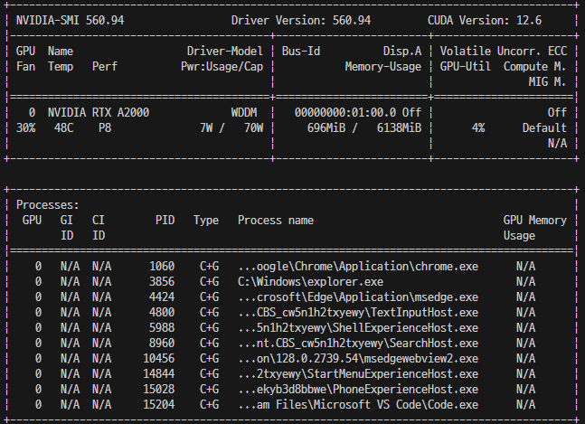

# Sakana.ai GPU 버전 Windows 프로젝트 시작하기

- 윈도우 **Powershell** 에서 실행할 경우 많은 오류가 발생 하므로  
  **git-scm** 설치한 후 **git bash shell** 에서 작업
- Sakana.ai 공식 사이트 : https://sakana.ai/ai-scientist/


## Visual Studio 설치

- https://visualstudio.microsoft.com/ko/downloads/ 에서 다운로드 후 설치  
  설치옵션에서 **C/C++ 개발환경을 반드시 체크하고 설치한다**

## 프로젝트 환경 만들기

### 모델학습을 위하여 CUDA 지원 고성능 GPU 그래픽카드 설치

- TITAN, Quadro 급의 GPU 설치된 그래픽카드를 선택하는 것이 좋다
- CUDA 지원 그래픽 카드 찾기 : https://developer.nvidia.com/cuda-gpus
- `Compute Capability` 가 최소 **7.x** 이상의 성능을 가진 그래픽카드를 선택해야 한다
- 그래픽 카드에 맞는 드라이버를 설치 : https://www.nvidia.com/ko-kr/geforce/drivers/

### nVIDIA GPU CUDA 소프트웨어 설치하기

- CUDA ToolKit 다운로드 : https://developer.nvidia.com/cuda-downloads
- CUDA Archive 에서 12.4.x 다운로드 : https://developer.nvidia.com/cuda-toolkit-archive  
CUDA 최신 버전은 12.6.x 이지만, torch 에서 지원하는 버전은 12.4.x 이므로 Archive 에서 12.4.x 를 다운받아 설치한다
- cuDNN 다운로드 : https://developer.nvidia.com/rdp/cudnn-archive
- cuDNN 다운로드 파일 압축 해제하고, `C: / Program Files / NVIDIA GPU Computing Toolkit / CUDA / v12.4` 폴더에 붙이기

### GPU CODA 컴파일러 등 설치 확인

```bash
$ nvcc -V
nvcc: NVIDIA (R) Cuda compiler driver
Copyright (c) 2005-2024 NVIDIA Corporation
Built on Thu_Mar_28_02:30:10_Pacific_Daylight_Time_2024
Cuda compilation tools, release 12.4, V12.4.131
Build cuda_12.4.r12.4/compiler.34097967_0
```

### GPU CUDA 활성화 확인

```bash
nvidia-smi
```



## 프로젝트 시작하기

### 프로젝트 소스코드 다운로드 받기

- github.com 에서 클론

```bash
git clone https://github.com/SakanaAI/AI-Scientist.git
```

### 아나콘다 가상환경 시작 및 Dependencies Package 설치

```bash
conda create -n ai_scientist python=3.11
conda activate ai_scientist

# Install pypi requirements
# requirements.txt 파일에서 torch 항목 주석처리
pip3 install -r requirements.txt
```

- `conda create` 실행 시 다음 오류 발생할 경우 clean 실행 후 다시 `conda create`

```bash
bash: C:\ProgramDatanaconda3\Scripts: No such file or directory

# Anaconda Environment Clean
conda clean -i
conda create -n ai_scientist python=3.11
```

- `conda activate` 명령 실행 시 `CondaError` 오류가 발생할 경우  
  `source` 명령 실행 후 다시 `conda activate`

```bash
CondaError: Run 'conda init' before 'conda activate'

# Shell Profile 환경 설정
conda init bash
source ~/.bash_profile
conda activate ai_scientist
```

### 아나콘다 GPU 활성화하기

```bash
conda install cuda -c nvidia
conda install cuda -c nvidia/label/cuda-12.4

```

- CUDA 버전별 torch 링크 확인 하여 명령 실행 : https://pytorch.org/get-started/locally/

```bash
# Install torch 11.8
pip3 install torch torchvision torchaudio --index-url https://download.pytorch.org/whl/cu118

# Install torch v 12.4
pip3 install torch torchvision torchaudio --index-url https://download.pytorch.org/whl/cu124


# Install torch 12.1
pip3 install torch torchvision torchaudio --index-url https://download.pytorch.org/whl/cu121

pip install torch==2.1.2 torchvision==0.16.2 torchaudio==2.1.2 --index-url https://download.pytorch.org/whl/cu121

```

### Tex Tool(PDF 생성 도구) 설치

##### Install pdflatex for Ubuntu

```bash
sudo apt-get install texlive-full
```

- `sudo apt-get install textlive-full` 명령은 **Ubuntu** Linux 명령으로 윈도우에서는 다음과 같이 다운로드 하여 설치한다.

##### Windows 버전 다운로드 및 설치

- **textlive-full**, **window** 버전 댜운로드 : `https://www.tug.org/texlive/windows.html`
- 위의 링크에서 다운로드 받아 설치해야 한다. 설치하는 시간이 상당히 오래 걸린다.

- 설치 후 다음과 같은 경고가 나오는 경우

```bash
*** PLEASE READ THIS WARNING ***********************************

The following (inessential) packages failed to install properly:

  tex4ht

You can fix this by running this command:

to complete the installation.

However, if the problem was a failure to download (by far the
most common cause), check that you can connect to the chosen mirror
in a browser; you may need to specify a mirror explicitly.
******************************************************************
```

- 업데이트 명령 실행

```bash
tlmgr update --all --reinstall-forcibly-removed
```

## Setup NanoGPT 모델 학습 및 생성

### Prepare NanoGPT data

- 모델 학습 및 문서 생성을 하기전에 다음의 스크립트를 먼저 실행해야 한다.

```bash
python data/enwik8/prepare.py
python data/shakespeare_char/prepare.py
python data/text8/prepare.py
```

## Create baseline runs (machine dependent)

- Set up NanoGPT baseline run

```bash
cd templates/nanoGPT && python experiment.py --out_dir run_0
python plot.py
```

