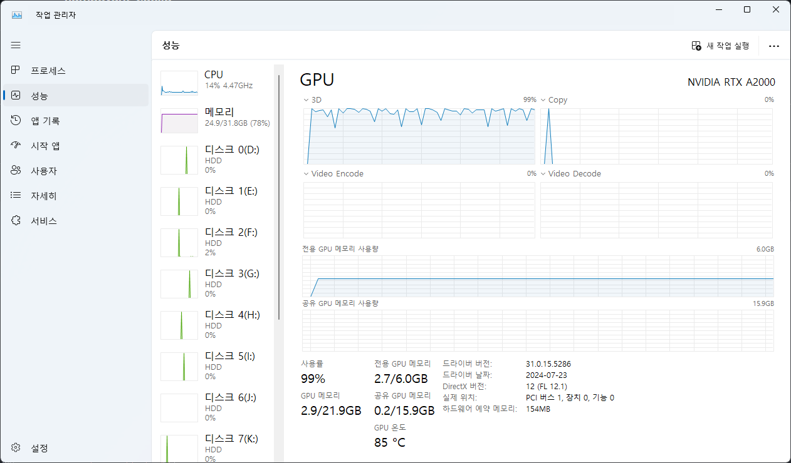

# GPU 버전 프로젝트 시작하기

- github 에서 클론

```bash
git clone https://github.com/SakanaAI/AI-Scientist.git
```

### nVIDIA GPU 설정하기

- 그래픽 카드에 맞는 드라이버를 설치
- CUDA ToolKit 다운로드 : https://developer.nvidia.com/cuda-downloads
- cuDNN 다운로드 : https://developer.nvidia.com/rdp/cudnn-archive
- cuDNN 다운로드 파일 압축 해제하고, `C: / Program Files / NVIDIA GPU Computing Toolkit / CUDA / v12.6` 폴더에 붙이기
- GPU CODA 컴파일러 확인

```bash
$ nvcc -V
nvcc: NVIDIA (R) Cuda compiler driver
Copyright (c) 2005-2024 NVIDIA Corporation
Built on Wed_Aug_14_10:26:51_Pacific_Daylight_Time_2024
Cuda compilation tools, release 12.6, V12.6.68
Build cuda_12.6.r12.6/compiler.34714021_0
```

- GPU CUDA 활성화 확인

```bash
nvidia-smi
```



### 아나콘다 가상환경 시작 및 패키지 설치

```bash
conda create -n ai_scientist python=3.11
conda activate ai_scientist
# Install pdflatex
sudo apt-get install texlive-full

# Install pypi requirements
# requirements.txt 파일에서 torch 항목 주석처리
pip install -r requirements.txt

# Install torch v 12.4
pip3 install torch torchvision torchaudio --index-url https://download.pytorch.org/whl/cu124

# Install torch 11.8
pip3 install torch torchvision torchaudio --index-url https://download.pytorch.org/whl/cu118

# Install torch 12.1
pip3 install torch torchvision torchaudio --index-url https://download.pytorch.org/whl/cu121

```

- `conda create` 실행 오류 발생할 경우

```bash
bash: C:\ProgramDatanaconda3\Scripts: No such file or directory
```

- 다음 명령으로 clean 실행 후 다시 `conda create`

```bash
conda clean -i
```

- bash 에서 activate 오류 발생하면 `source` 명령 실행 후 `conda activate`

```bash
CondaError: Run 'conda init' before 'conda activate'
```

```bash
source ~/.bash_profile
```

- `sudo apt-get install textlive-full` 명령은 **Ubuntu** Linux 명령으로 윈도우에서는 다음의 링크에서 다운로로드 받아 설치해야 한다. 설치하는 시간이 상당히 오래 걸린다
- **textlive-full**, **window** 버전 댜운로드 : https://www.tug.org/texlive/windows.html
- 설치 후 다음과 같은 경고가 나오면 업데이트 실행

```bash
tlmgr update --all --reinstall-forcibly-removed
```

```bash
*** PLEASE READ THIS WARNING ***********************************

The following (inessential) packages failed to install properly:

  tex4ht

You can fix this by running this command:

to complete the installation.

However, if the problem was a failure to download (by far the
most common cause), check that you can connect to the chosen mirror
in a browser; you may need to specify a mirror explicitly.
******************************************************************
```

## Setup NanoGPT

### Prepare NanoGPT data

```bash
python data/enwik8/prepare.py
python data/shakespeare_char/prepare.py
python data/text8/prepare.py
```

## Create baseline runs (machine dependent)

- Set up NanoGPT baseline run
- 참고: 먼저 위의 준비 스크립트를 실행해야 합니다!

```bash
cd templates/nanoGPT
python experiment.py --out_dir run_0
python plot.py
```

- 모델학습 과정에서 다음과 같은 오류 발생

```bash
$ python experiment.py --out_dir run_0
Traceback (most recent call last):
  File "C:\Users\callor\Documents\workspace\Callor-sakana.ai-2024\AI-Scientist\templates\nanoGPT\experiment.py", line 10, in <module>
    import torch
  File "C:\Users\callor\.conda\envs\ai_scientist\Lib\site-packages\torch\__init__.py", line 148, in <module>
    raise err
OSError: [WinError 126] 지정된 모듈을 찾을 수 없습니다. Error loading "C:\Users\callor\.conda\envs\ai_scientist\Lib\site-packages\torch\lib\fbgemm.dll" or one of its dependencies.
(ai_scientist)
```

- Visual Studio 설치해주어야 한다. 설치옵션에서 **C/C++ 개발환경을 반드시 체크하고 설치한다**

## GPU 활성화하기

```bash
conda install cuda -c nvidia
```
