# Getting started with Sakana.ai GPU version Windows project

- When running in Windows **Powershell**, many errors occur, so let's work in **git bash shell** after installing **git-scm**.
- It is also possible in Windows cmd.exe environment. There is a difference in the **conda init** command below.
- Sakana.ai Official Site : https://sakana.ai/ai-scientist/

## Visual Studio Install

- Download and Install from https://visualstudio.microsoft.com/ko/downloads/
- Make sure to check and install the **C/C++ development environment** in the installation options.

## Anaconda Install
#### Download and Install from https://www.anaconda.com/download/success  

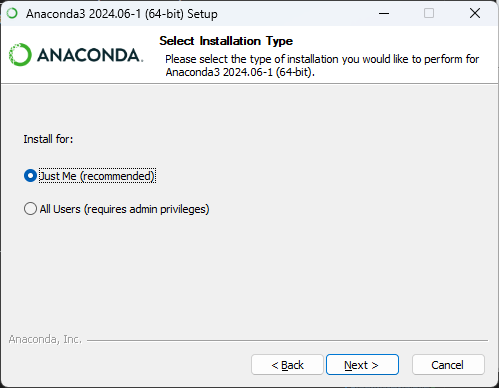

#### If your Windows account name is not in English,, Make sure to install with **All User** experience

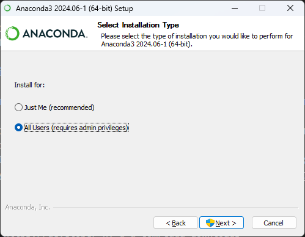

#### Remember where Anaconda is installed  : **Just Me**

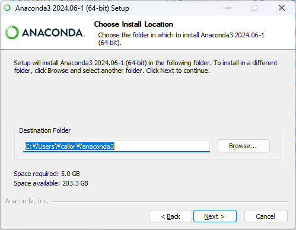

#### Remember where Anaconda is installed  : **All User**

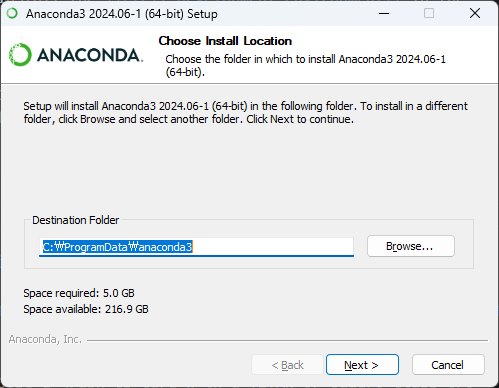

- Check Clear the package cache upon completion

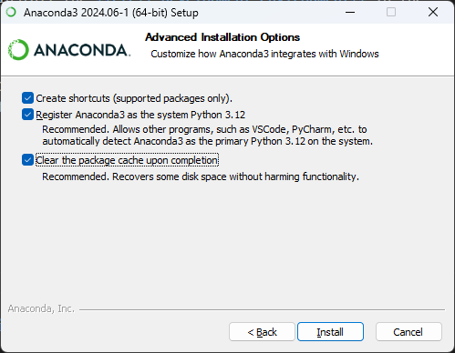

- Once the installation is complete, open the Aaconda installation folder and check the location of the envs folder.
- Anaconda virtual machine will be installed in this folder.

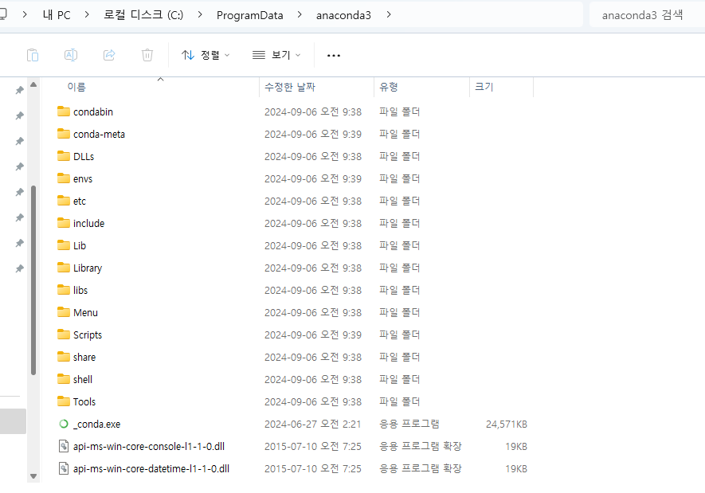

- For convenience, let's add the Anaconda environment to the **path** item in the Windows environment variables.
```
C:\ProgramData\anaconda3\bin;
C:\ProgramData\anaconda3\conda\bin;
C:\ProgramData\anaconda3\Scripts
C:\ProgramData\anaconda3\conda\bin
```
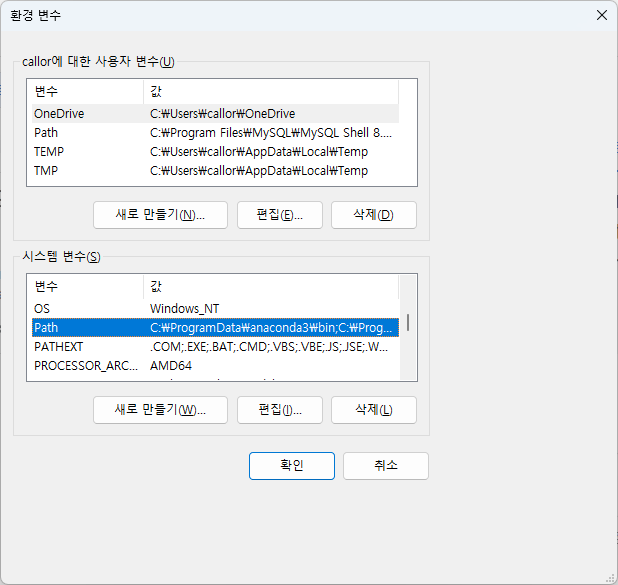
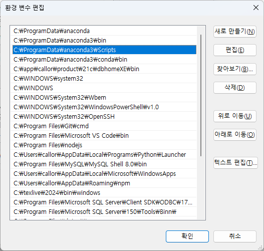

- Start vscode and run the conda command in the terminal.
- You should see a screen similar to the following
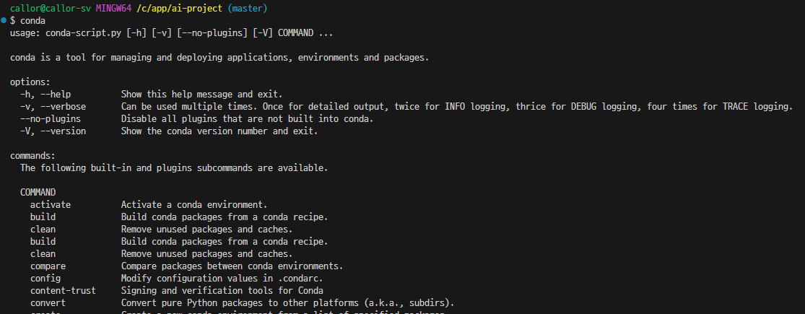

## Creating a project environment

### Install a high-performance **GPU** graphics card that supports **CUDA** for model training.

- It is recommended to choose a graphics card with a TITAN or Quadro-class GPU installed.
- Find a CUDA-enabled graphics card : https://developer.nvidia.com/cuda-gpus
- You must select a graphics card with a **Compute Capability** of at least **7.x** or higher.
- Install the driver for your graphics card : https://www.nvidia.com/ko-kr/geforce/drivers/

### Installing nVIDIA GPU CUDA Software

- CUDA ToolKit Download : https://developer.nvidia.com/cuda-downloads
- Download 12.4.x from CUDA Archive : https://developer.nvidia.com/cuda-toolkit-archive  
  The latest version of CUDA is 12.6.x, but the version supported by torch is 12.4.x, so download 12.4.x from the Archive and install it.
- cuDNN Download : https://developer.nvidia.com/rdp/cudnn-archive
- Unzip the cuDNN download file and paste it into the `C:/Program Files/NVIDIA GPU Computing Toolkit/CUDA/v12.4` folder.

### Check installation of GPU CUDA compiler

```bash
$ nvcc -V
nvcc: NVIDIA (R) Cuda compiler driver
Copyright (c) 2005-2024 NVIDIA Corporation
Built on Thu_Mar_28_02:30:10_Pacific_Daylight_Time_2024
Cuda compilation tools, release 12.4, V12.4.131
Build cuda_12.4.r12.4/compiler.34097967_0
```

### Check GPU CUDA activation

```bash
nvidia-smi
```

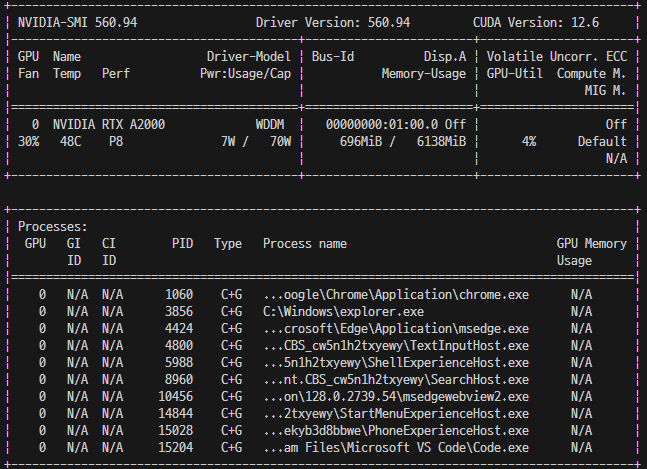

## Start a project

### Download project source code

- Clone From github.com

```bash
git clone https://github.com/SakanaAI/AI-Scientist.git
```

- Always update to the latest project before running the project (running launch_scientist.py).
- Run the following command in the **AI-Scientist** folder:

```bash
git pull
```

### Start Anaconda Virtual Environment and Install Dependencies Package

```bash
conda create -n ai_scientist python=3.11
```
- If the following error occurs when running `conda create`, run clean and then `conda create` again.

```bash
# Error Message
bash: C:\ProgramDatanaconda3\Scripts: No such file or directory
```

```bash
# Solution : Anaconda Environment Clean
conda clean -i
conda create -n ai_scientist python=3.11
```

```bash
conda activate ai_scientist
```
### If a `CondaError` error occurs when running the `conda activate` command   After running the `source` command, run `conda activate` again

```bash
CondaError: Run 'conda init' before 'conda activate'

# Shell Profile Preferences
conda init bash
source ~/.bash_profile
conda activate ai_scientist
```
- If the `source ~/.bash_profile` command returns a message that the `.bash_profile` file does not exist,  
run the `touch ~/.bash_profile` command and then run the `source ~/.bash_profile` command.

- You should see the message `(ai_scientist)` at the `bash shell` prompt.

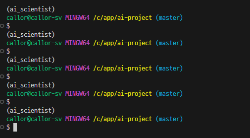

#### If you are using cmd.exe in Windows, run it as follows:
```cmd.exe
conda init cmd.exe
```

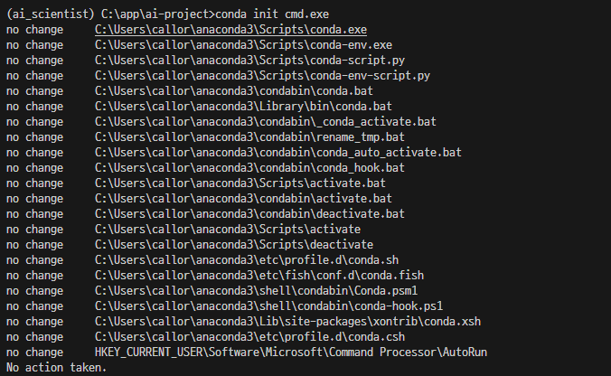

- Then the prompt will change to:

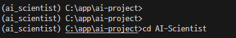

### Install pypi requirements
```bash
pip3 install -r requirements.txt
```

### Activate Anaconda GPU

- Run this only if you have problems recognizing your GPU when running **launch_scientist**

```bash
# Install according to the CUDA version from the following commands.
# If you installed it in this document environment, the second command is
conda install cuda -c nvidia
conda install cuda -c nvidia/label/cuda-12.4
```

- Check the torch link for each CUDA version and execute the command :  
  https://pytorch.org/get-started/locally/
- Run this only if you have trouble running **launch_scientist**

```bash
# Install torch v 12.4
pip3 install torch torchvision torchaudio --index-url https://download.pytorch.org/whl/cu124
```

### Install Tex Tool (PDF creation tool)

##### Install pdflatex for Ubuntu

- The following command is only executable on Ubuntu Linux. For Windows installation, see the following:

```bash
sudo apt-get install texlive-full
```

##### Download and install Windows version

- **textlive-full**, **window** version download : `https://www.tug.org/texlive/windows.html`
- You need to download and install it from the link above. It will take quite a while to install.

- If you see the following warning after installation, run the **update command** below.

```bash
*** PLEASE READ THIS WARNING ***********************************

The following (inessential) packages failed to install properly:

  tex4ht

You can fix this by running this command:

to complete the installation.

However, if the problem was a failure to download (by far the
most common cause), check that you can connect to the chosen mirror
in a browser; you may need to specify a mirror explicitly.
******************************************************************
```

- TexLive **Running the Update Command**

```bash
tlmgr update --all --reinstall-forcibly-removed
```

## Setup NanoGPT

### Prepare NanoGPT data

- Before training the model and generating documentation, you must first run the following script.

```bash
python data/enwik8/prepare.py
```
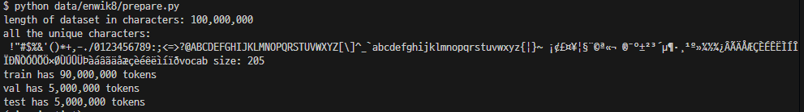

```bash
python data/shakespeare_char/prepare.py
```
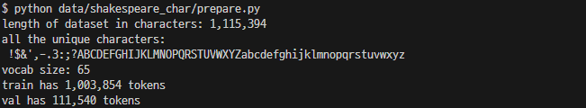
```bash
python data/text8/prepare.py
```

```bash
python data/enwik8/prepare.py && python data/shakespeare_char/prepare.py && python data/text8/prepare.py
```

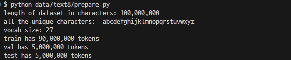

### Project Start : Model training and sample paper generation

### The following API keys must be registered in the environment variables before running the project.

- You must obtain an API key from openAI (paid) and the environment variable **OPENAI_API_KEY** must be set.
- You must register at https://www.semanticscholar.org/product/api and obtain an API key (free of charge).
  The issued API key must be set in the environment variable **S2_API_KEY**


### The way projects are run has changed on September 2, 2024.

```bash
conda activate ai_scientist
```

### Run the paper generation.

#### Create a result generation folder. Otherwise, an error will occur during model training and execution will stop.
```
\AI-Scientist\templates\nanoGPT\run_0\final_info.json
```

- Add cuda GPU Dependency
```bash
conda install cuda -c nvidia/label/cuda-12.4
```

- Install GPU enabled torch
```bash
# Install torch v 12.4
pip3 install torch torchvision torchaudio --index-url https://download.pytorch.org/whl/cu124 --upgrade
```

### If the following error occurs while running the project, you need to install a different version of torch.
```
C:\Users\callor\.conda\envs\ai_scientist\Lib\site-packages\torch\_dynamo\utils.py:1903: UserWarning: 1Torch was not compiled with flash attention. (Triggered internally at C:\actions-runner\_work\pytorch\pytorch\builder\windows\pytorch\aten\src\ATen\native\transformers\cuda\sdp_utils.cpp:555.)
  return node.target(*args, **kwargs)
```  

Change **torch** version if error occurs

```bash
pip3 install torch==2.1.2 torchvision==0.16.2 torchaudio==2.1.2 xformers --index-url https://download.pytorch.org/whl/cu121 --upgrade
python -m pip install --pre torch torchvision torchaudio --index-url https://download.pytorch.org/whl/nightly/cu124 --upgrade
python -m pip install --pre torch torchvision torchaudio --index-url https://download.pytorch.org/whl/cu124 --upgrade
```

### Create baseline runs (machine dependent)
- Set up NanoGPT baseline run
- NOTE: YOU MUST FIRST RUN THE PREPARE SCRIPTS ABOVE!
```bash
cd templates/nanoGPT && python experiment.py --out_dir run_0 && python plot.py
python experiment.py --out_dir run_0 && python plot.py
```

#### If you use openAI's gpt-4o-xx

```bash
python launch_scientist.py --model "gpt-4o-2024-05-13" --experiment nanoGPT --num-ideas 2
```

#### The project is in progress with GPU 0 in use( Using GPUs[0] )

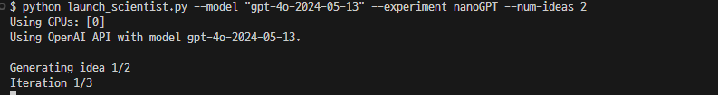

- If multiple GPUs (Graphic Cards) are installed, it will probably look like Using GPUs[0,1,2]

#### Now you have to wait about 30 to 40 minutes.
#### Let's watch a movie while looking at the messages that appear on the terminal screen sometimes!! But, use a different computer to watch the movie.

#### Although I have not yet obtained a completed paper because a failure occurred in the middle of the process and the process stopped, I have currently trained the model using the `openAI API` and `Semantic Scholar API` and executed it up to the stage before paper creation.


#### 이미 생성된 Idea 재사용하면서 진행하기
```bash
python launch_scientist.py --model "gpt-4o-2024-05-13" --experiment nanoGPT --num-ideas 2 --skip-idea-generation
```
--skip-idea-generation


#### If you use claude-3-6-sonet-xx

```bash
python launch_scientist.py --model "claude-3-5-sonnet-20240620" --experiment nanoGPT_lite --num-ideas 2
```


```sh
python experiment.py --out_dir=run_1
```