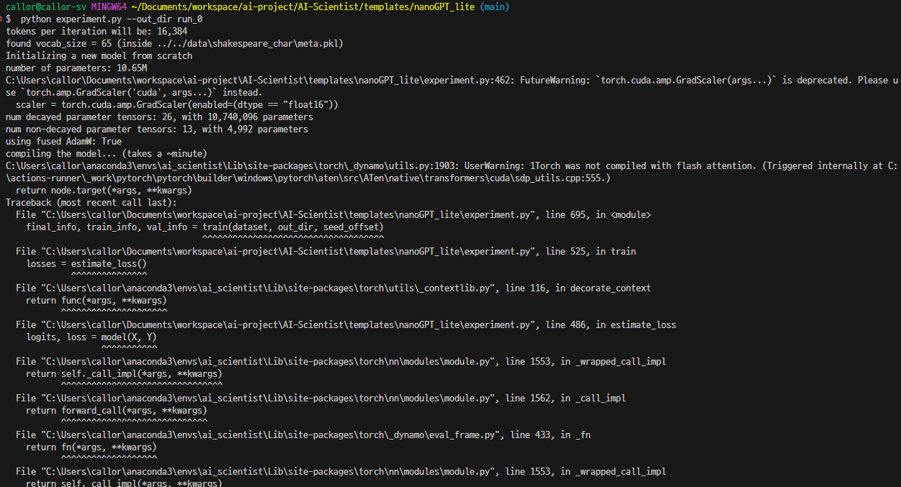
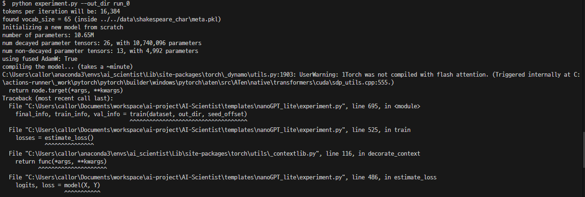
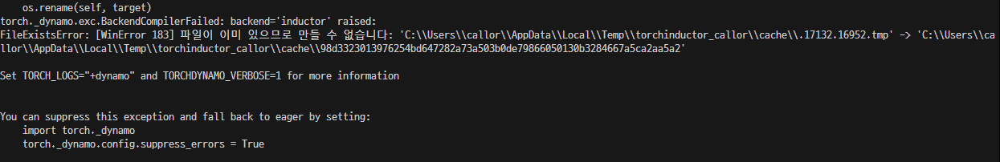

# A collection of troubleshooting methods

### Visual Studio install

- If the following error (fbgemm.dll not found) occurs during the model learning process,  
you must install Visual Studio. In the installation options, be sure to check **C/C++ development environment and install**

```bash
# python experiment.py --out_dir run_0 Command execution error

Traceback (most recent call last):
  File "C:\Users\USERNAME\Documents\workspace\Callor-sakana.ai-2024\AI-Scientist\templates\nanoGPT\experiment.py", line 10, in <module>
    import torch
  File "C:\Users\USERNAME\.conda\envs\ai_scientist\Lib\site-packages\torch\__init__.py", line 148, in <module>
    raise err
OSError: [WinError 126] 지정된 모듈을 찾을 수 없습니다. Error loading "C:\Users\USERNAME\.conda\envs\ai_scientist\Lib\site-packages\torch\lib\fbgemm.dll" or one of its dependencies.
(ai_scientist)
```

## but CUDA is not available

```bash
$ python experiment.py --out_dir run_0
tokens per iteration will be: 16,384
C:\Users\callor\anaconda3\envs\ai_scientist\Lib\site-packages\torch\amp\autocast_mode.py:265: UserWarning: User provided device_type of 'cuda', but CUDA is not available. Disabling
  warnings.warn(
found vocab_size = 65 (inside ../../data\shakespeare_char\meta.pkl)
Initializing a new model from scratch
number of parameters: 10.65M
Traceback (most recent call last):
  File "C:\Users\callor\Documents\workspace\ai-project\AI-Scientist\templates\nanoGPT\experiment.py", line 697, in <module>
    final_info, train_info, val_info = train(dataset, out_dir, seed_offset)
                                       ^^^^^^^^^^^^^^^^^^^^^^^^^^^^^^^^^^^^
```

![alt text]./images/error/(image.png)

```bash
# Install torch v 12.4
pip3 install torch torchvision torchaudio --index-url https://download.pytorch.org/whl/cu124

```

## Compile error 1

```bash
tokens per iteration will be: 16,384
found vocab_size = 65 (inside ../../data\shakespeare_char\meta.pkl)
Initializing a new model from scratch
number of parameters: 10.65M
C:\Users\callor\Documents\workspace\ai-project\AI-Scientist\templates\nanoGPT_lite\experiment.py:462: FutureWarning: `torch.cuda.amp.GradScaler(args...)` is deprecated. Please use `torch.amp.GradScaler('cuda', args...)` instead.
  scaler = torch.cuda.amp.GradScaler(enabled=(dtype == "float16"))
num decayed parameter tensors: 26, with 10,740,096 parameters
num non-decayed parameter tensors: 13, with 4,992 parameters
using fused AdamW: True
compiling the model... (takes a ~minute)
Traceback (most recent call last):
  File "C:\Users\callor\anaconda3\envs\ai_scientist\Lib\site-packages\torch\_dynamo\output_graph.py", line 1446, in _call_user_compiler
    compiled_fn = compiler_fn(gm, self.example_inputs())
                  ^^^^^^^^^^^^^^^^^^^^^^^^^^^^^^^^^^^^^^
  File "C:\Users\callor\anaconda3\envs\ai_scientist\Lib\site-packages\torch\_dynamo\repro\after_dynamo.py", line 129, in __call__
    compiled_gm = compiler_fn(gm, example_inputs)
                  ^^^^^^^^^^^^^^^^^^^^^^^^^^^^^^^
```



```py
# Find the following code near line 461 and change it as follows:
# initialize a GradScaler. If enabled=False scaler is a no-op
scaler = torch.cuda.amp.GradScaler(enabled=(dtype == "float16"))

# initialize a GradScaler. If enabled=False scaler is a no-op
scaler = torch.amp.GradScaler('cuda',enabled=(dtype == "float16"))
```

## compile error 2

```bash
C:\Users\callor\anaconda3\envs\ai_scientist\Lib\site-packages\torch\_dynamo\utils.py:1903: UserWarning: 1Torch was not compiled with flash attention. (Triggered internally at C:\actions-runner\_work\pytorch\pytorch\builder\windows\pytorch\aten\src\ATen\native\transformers\cuda\sdp_utils.cpp:555.)
  return node.target(*args, **kwargs)
Traceback (most recent call last):
  File "C:\Users\callor\Documents\workspace\ai-project\AI-Scientist\templates\nanoGPT_lite\experiment.py", line 695, in <module>
    final_info, train_info, val_info = train(dataset, out_dir, seed_offset)
                                       ^^^^^^^^^^^^^^^^^^^^^^^^^^^^^^^^^^^^


  File "C:\Users\callor\anaconda3\envs\ai_scientist\Lib\site-packages\torch\_inductor\scheduler.py", line 742, in _compute_attrs
    group_fn = self.scheduler.get_backend(self.node.get_device()).group_fn
               ^^^^^^^^^^^^^^^^^^^^^^^^^^^^^^^^^^^^^^^^^^^^^^^^^^
  File "C:\Users\callor\anaconda3\envs\ai_scientist\Lib\site-packages\torch\_inductor\scheduler.py", line 2663, in get_backend
    self.backends[device] = self.create_backend(device)
                            ^^^^^^^^^^^^^^^^^^^^^^^^^^^
  File "C:\Users\callor\anaconda3\envs\ai_scientist\Lib\site-packages\torch\_inductor\scheduler.py", line 2655, in create_backend
    raise RuntimeError(
torch._dynamo.exc.BackendCompilerFailed: backend='inductor' raised:
RuntimeError: Cannot find a working triton installation. More information on installing Triton can be found at https://github.com/openai/triton

Set TORCH_LOGS="+dynamo" and TORCHDYNAMO_VERBOSE=1 for more information


You can suppress this exception and fall back to eager by setting:
    import torch._dynamo
    torch._dynamo.config.suppress_errors = True
```



```bash
pip install https://huggingface.co/madbuda/triton-windows-builds/resolve/main/triton-2.1.0-cp311-cp311-win_amd64.whl
```



- `C:\Users\USERNAME\AppData\Local\Temp` Delete the folder contents and run again

```bash
pip3 install --force-reinstall --pre torch torchtext torchvision torchaudio torchrec --extra-index-url https://download.pytorch.org/whl/nightly/cu121
```

- If the following error occurs during model learning, create the following path and file and run again.
```bash
C:\app\ai-project\AI-Scientist\templates\nanoGPT\run_0\final_info.json
```
```bash
Processing idea: adaptive_block_size
Failed to evaluate idea adaptive_block_size: [Errno 2] No such file or directory: 'templates\\nanoGPT\\run_0\\final_info.json'
Processing idea: adaptive_dropout
Failed to evaluate idea adaptive_dropout: [Errno 2] No such file or directory: 'templates\\nanoGPT\\run_0\\final_info.json'
Processing idea: memory_buffer_gpt
Failed to evaluate idea memory_buffer_gpt: [Errno 2] No such file or directory: 'templates\\nanoGPT\\run_0\\final_info.json'
All ideas evaluated.
```