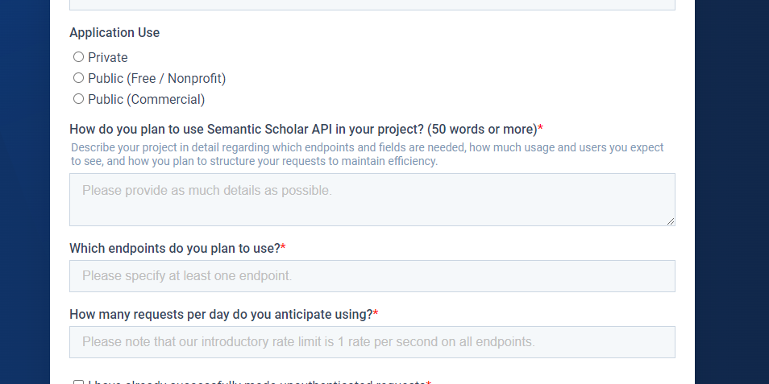

# 오류 해결방법 모음


### Visual Studio 설치

- 모델학습 과정에서 다음과 같은 오류(fbgemm.dll 찾지 못함) 발생하면  
  Visual Studio 설치해주어야 한다. 설치옵션에서 **C/C++ 개발환경을 반드시 체크하고 설치한다**

```bash
# python experiment.py --out_dir run_0 명령실행 오류

Traceback (most recent call last):
  File "C:\Users\USERNAME\Documents\workspace\Callor-sakana.ai-2024\AI-Scientist\templates\nanoGPT\experiment.py", line 10, in <module>
    import torch
  File "C:\Users\USERNAME\.conda\envs\ai_scientist\Lib\site-packages\torch\__init__.py", line 148, in <module>
    raise err
OSError: [WinError 126] 지정된 모듈을 찾을 수 없습니다. Error loading "C:\Users\USERNAME\.conda\envs\ai_scientist\Lib\site-packages\torch\lib\fbgemm.dll" or one of its dependencies.
(ai_scientist)
```

## 컴파일 오류 1



```py    
# 461 라인 근처에서 다음 코드를 찾아서 아래와 같이 변경
# initialize a GradScaler. If enabled=False scaler is a no-op
scaler = torch.cuda.amp.GradScaler(enabled=(dtype == "float16"))

# initialize a GradScaler. If enabled=False scaler is a no-op
scaler = torch.amp.GradScaler('cuda',enabled=(dtype == "float16"))
```

```bash
C:\Users\callor\anaconda3\envs\ai_scientist\Lib\site-packages\torch\_dynamo\utils.py:1903: UserWarning: 1Torch was not compiled with flash attention. (Triggered internally at C:\actions-runner\_work\pytorch\pytorch\builder\windows\pytorch\aten\src\ATen\native\transformers\cuda\sdp_utils.cpp:555.)
  return node.target(*args, **kwargs)
Traceback (most recent call last):
  File "C:\Users\callor\Documents\workspace\ai-project\AI-Scientist\templates\nanoGPT_lite\experiment.py", line 695, in <module>
    final_info, train_info, val_info = train(dataset, out_dir, seed_offset)
                                       ^^^^^^^^^^^^^^^^^^^^^^^^^^^^^^^^^^^^
```                                       


```bash
pip3 install --force-reinstall --pre torch torchtext torchvision torchaudio torchrec --extra-index-url https://download.pytorch.org/whl/nightly/cu121
```