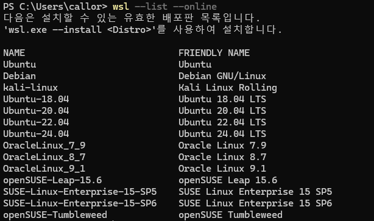
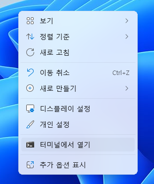
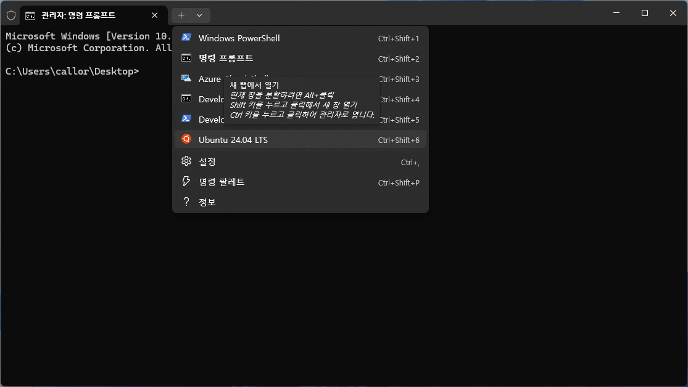
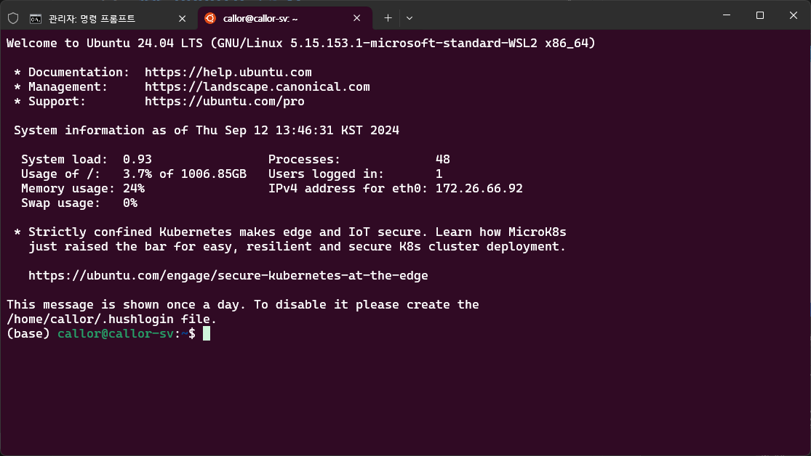
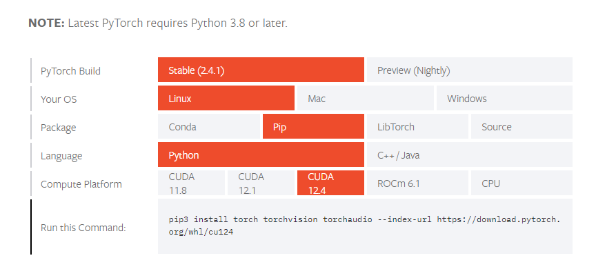
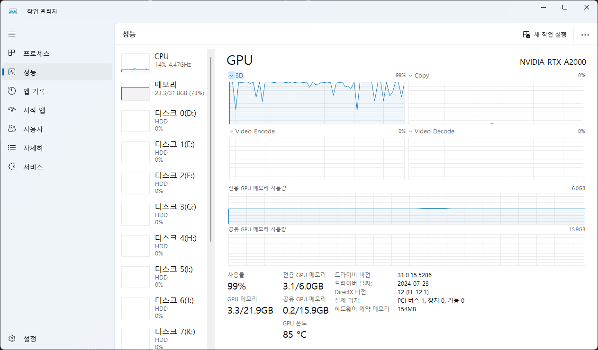

# wsl 기반 ubuntu 프로젝트
`wsl` : 윈도우 하위시스템 리눅스, Windows Subsystem for Linux, 윈도우 10, 11 환경에서 리눅스를 설치할 수 있는 환경

`Windows 10 버전 2004 이상(빌드 19041 이상)` 또는 `Windows 11` 에서 제공하는 개발환경

## wsl 설치

윈도우 `power shell` 을 관리자 모드로 실행하여 명령을 수행한다
```shell
wsl --install
```
공식문서에는 이 명령으로 `wsl` 이 설치되고 `ubuntu` linux 가 설치된다고 되어 있으나 `windows11` 환경에서 실행한 결과 `ubuntu`는 같이 설치되지 않는다

## ubuntu 설치
`wsl` 설치가 완료된 후 `ubuntu` 를 설치한다

`wsl` 환경에 설치할 수 있는 `linux` 배포판을 찾아보자

```bash
wsl --list --online
```


이 프로젝트에서는 `ubuntu 24.04.lte` 버전을 설치하였다.

```bash
wsl --install Ubuntu-24.04
```

## ubuntu 실행하기


바탕화면에서 마우스 우클릭 `터미널 열기`를 선택


터미널 창에서 `ubuntu-xx` 를 선택하면 `linux shell` 창이 나타난다.
 

## 아나콘다 설치
지금부터의 명령은 `linux shell` 에서 입력해야 한다

패키지 정보 업데이트(반드시 sudo, root 권한)
```shell
sudo apt update
```
`curl` 도구 설치(반드시 sudo, root 권한)
```shell
sudo apt install curl -y
```
아나콘다 설치(반드시 sudo, root 권한)
```shell
curl --output anaconda.sh https://repo.anaconda.com/archive/Anaconda3-2024.06-1-Linux-x86_64.sh
```

공식사이트를 통하여 옵션을 확인하자 : https://docs.anaconda.com/anaconda/install/linux/
아나콘다 Archive : https://repo.anaconda.com/archive/

- 아나콘다 설치 후 시스템 업그레이드를 한번 실행
```shell
sudo apt update
sudp apt upgrade
```

- `CUDA` 용 `torch` 재 설치
- https://pytorch.org/get-started/locally/ 여기에 접속하여 자신의 GPU 에 맞는 `CUDA` 용 `torch` 를 찾아서 재 설치한다



- `Run this command` 항목의 스크립트를 복사하여 `shell`에서 실행한다. 이때 끝부분에 반드시 `--upgrade` 를 붙인다
```shell
pip3 install torch torchvision torchaudio --index-url https://download.pytorch.org/whl/cu124 --upgrade
```
#### `conda`에 `CUDA` 도구 (재) 설치
#### 프로젝트 **github** 에는 없지만 이 과정을 생략하면, 모델 컴파일과 모델 훈련과정을 실행 할 수 없다

```shell
conda install cuda -c nvidia/label/cuda-12.4
```

## 프로젝트 시작

- `user home 으로 이동`
```shell
cd
pwd
# /home/user
```

- `Ai-Scientist git clone`
```shell
git clone https://github.com/callor/Callor-sakana.ai-2024.git
```

- 프로젝트 초기화
```shell
conda create -n ai_scientist python=3.11
conda activate ai_scientist
# Install pdflatex
sudo apt-get install texlive-full

# Install pypi requirements
# AI-Scientist 폴더에서 실행
pip3 install -r requirements.txt
```

#### requirements.txt 에  torch 설치코드가 있으나, CUDA 버전과 호환이 되지 않는 것으로 보인다 다음 명령을 다시 한번 실행한다
```shell
pip3 install torch torchvision torchaudio --index-url https://download.pytorch.org/whl/cu124 --upgrade
```

#### conda 의 가상환경을 새로 만들고 가상환경에서 CUDA 를 다시 한번 설치한다.
```shell
conda install cuda -c nvidia/label/cuda-12.4
```

- 환경변수 세팅
- 현재 폴더에 `env.sh` 파일을 생성한 후 **openAI API Key** 와 **Semantic Scholar API Key** 를 저장한다
```shell
export OPENAI_API_KEY="USER OPEN AI KEY"
export S2_API_KEY="USER Sementic Schola API KEY"
```
- 환경변수 세팅을 위하여 다음 명령을 입력한다
```shell
source env.sh
```
- 환경변수 세팅이 되었는지 변수 확인을 한다

```shell
echo $OPENAI_API_KEY
# sk-proj-******

$ echo $S2_API_KEY
# Ep9******
```

## 프로젝트 진행

- 기본 모델 학습하기
```shell
# Prepare NanoGPT data
python data/enwik8/prepare.py
python data/shakespeare_char/prepare.py
python data/text8/prepare.py
```

### 기준선 생성(nanoGPT 기준)
기준선 생성은 github readme 에서는 1회만 실시하는 것으로 되어 있으나, 본 프로젝트 논문에서 최소5회 실행한 결과를 볼수 있다.
```shell
cd templates/nanoGPT && python experiment.py --out_dir run_0 && python plot.py
python experiment.py --out_dir run_1 && python plot.py
python experiment.py --out_dir run_2 && python plot.py
python experiment.py --out_dir run_3 && python plot.py
python experiment.py --out_dir run_4 && python plot.py
python experiment.py --out_dir run_5 && python plot.py
```
`entwik8`, `shakespeare_char_input`, `text8` 데이터를 사용하여 구체적 모델 생성을 위한 기준선 모델을 생성한다

#### 이 과정에서 1번 실행할때마다 약 3-4시간 가량 소요가 된다. GPU, 메모리 등 시스템 성능에 따라 시간차이가 많이 난다. 

#### 이 과정에서는 openAI 의 API 를 활용하지 않는다. GPU 의 사용량이 100%에서 진행되는 것을 볼 수 있다




